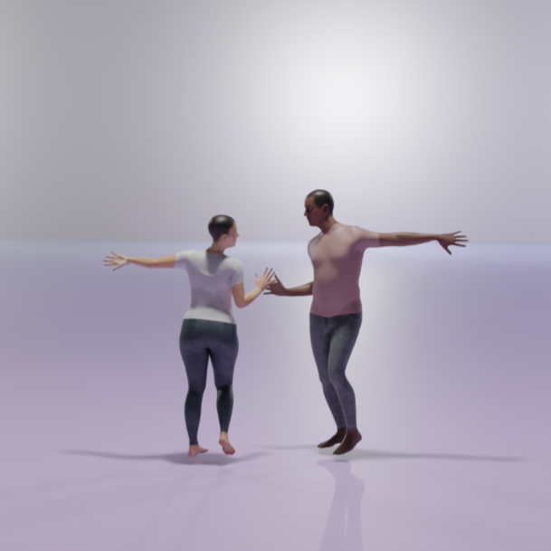
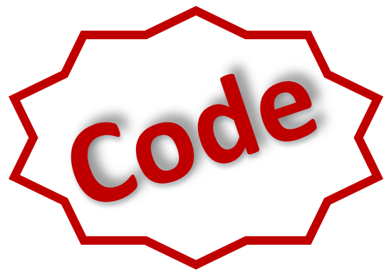

# DuetGen: Music Driven Two-Person Dance Generation via Hierarchical Masked Modeling [**SIGGRAPH 2025**]

Anindita Ghosh1,2,3*, Bing Zhou4, Rishabh Dabral2,3,Jian Wang4,  
Vladislav Golyanik2,3, Christian Theobalt2,3,
Philipp Slusallek1,3, Chuan Guo4    

1German Research Center for Artificial Intelligence (DFKI),  
2Max Planck Institute for Informatics,  
3Saarland Informatics Campus,  
4Snap Inc.

*Work done during internship at Snap Research NYC

*DuetGen generates synchronized two-person dance choreography from input music, featuring natural and close interactions between dancers.*

<table>
  <tr>
    <td align="center">
      <a href="https://anindita127.github.io/DuetGen">
         
        <strong>Project Page</strong>
      </a>
    </td>
    <td align="center">
      <a href="https://arxiv.org/abs/your_paper_id">
         
        <strong>ArXiv</strong>
      </a>
    </td>
    <td align="center">
      <a href="https://github.com/anindita127/DuetGen_codebase">
         
        <strong>Code</strong>
      </a>
    </td>
  </tr>
</table>

