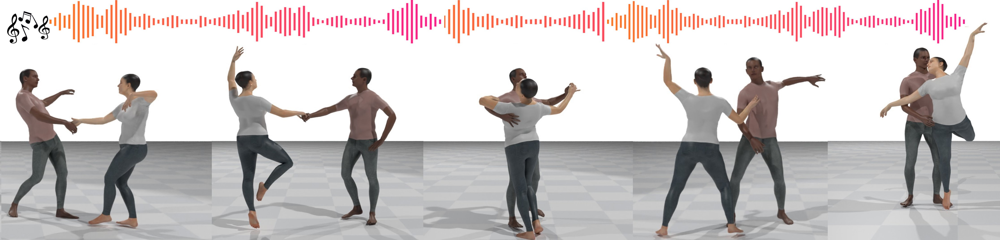

# DuetGen: Music Driven Two-Person Dance Generation via Hierarchical Masked Modeling

Anindita Ghosh1,2,3*, Bing Zhou4, Rishabh Dabral2,3,Jian Wang4,  
Vladislav Golyanik2,3, Christian Theobalt2,3,
Philipp Slusallek1,3, Chuan Guo4    

1German Research Center for Artificial Intelligence (DFKI),  
2Max Planck Institute for Informatics,  
3Saarland Informatics Campus,  
4Snap Inc.

*Work done during internship at Snap Research NYC

<em> ✨ accepted at SIGGRAPH 2025 conference track ✨ </em>

  
  
  

*DuetGen generates synchronized two-person dance choreography from input music, featuring natural and close interactions between dancers.*
